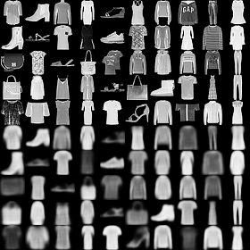

# CapsuleNet
[](./LICENSE)

([Pytorch](https://pytorch.org)) Implementation of the [Dynamic Routing Between Capsules](https://arxiv.org/pdf/1710.09829.pdf) paper by Hinton et al.

## Usage

1. Clone the repository

``` sh
git clone https://github.com/wssholmes/CapsuleNet.git
cd CapsuleNet
```

2. **[Optional]** Define a new experiment in the [experiments.json](./experiments.json) file.

3. Train the model using [train.py](./train.py)

``` sh
❯ python train.py -h
usage: train.py [-h] [-e EXPERIMENT] [-w WEIGHTS]

[Training] CapsuleNet

optional arguments:
  -h, --help            show this help message and exit
  -e EXPERIMENT, --experiment EXPERIMENT
                        Experiment to run from the experiments.json
  -w WEIGHTS, --weights WEIGHTS
                        Weights used to initialize the model
```

4. Evaluate on test set using [test.py](./test.py)

``` sh
❯ python test.py -h
usage: test.py [-h] [-e EXPERIMENT] [-w WEIGHTS]

[Testing] CapsuleNet

optional arguments:
  -h, --help            show this help message and exit
  -e EXPERIMENT, --experiment EXPERIMENT
                        Which experiment to run from the experiments.json,
                        default is BASE
  -w WEIGHTS, --weights WEIGHTS
                        Weights used to initialize the model for testing.

```

Results for both training and tests will be stored in the directory defined in `["files"]["save_dir"]` for the `EXPERIMENT` in the [experiments.json](./experiments.json) file.

## Experiments & Results

Following are the results obtained for various experiments (defined in [experiments.json](./experiments.json))

### Test Accuracy (%)

Experiment | MNIST| FASHION_MNIST | CIFAR10 | CIFAR100
:----------:|:----:|:-------------:|:-------:|:-------:
BASE        |99.690|    91.370     |  71.530 |    -

### Train-Val Loss & Accuracy(%)

Experiment | MNIST | FASHION_MNIST | CIFAR10 | CIFAR100
:---------:|:-----:|:-------------:|:-------:|:--------:
BASE |  |  |  | -

### Reconstruction

Top 5 rows are the source image (from the test set) and the bottom 5 are their corresponding reconstruction.

Experiment | MNIST | FASHION_MNIST | CIFAR10 | CIFAR100
:---------:|:-----:|:-------------:|:-------:|:--------:
BASE |  |  |  | -

## Future Work

- [ ] Add results for other datasets
- [ ] Try using smaller batch size (32 instead of 100)
- [ ] Change optimizer from Adam to SGD with Nesterov momentum

## References

* [XifengGuo/CapsNet-Pytorch](https://github.com/XifengGuo/CapsNet-Pytorch)
* [Understanding Hinton’s Capsule Networks. Part 1. Intuition.](https://pechyonkin.me/capsules-1/)
* [Understanding Hinton’s Capsule Networks. Part 2. How Capsules Work.](https://pechyonkin.me/capsules-2/)
* [Understanding Hinton’s Capsule Networks. Part 3. Dynamic Routing Between Capsules.](https://pechyonkin.me/capsules-3/)
* [Understanding Hinton’s Capsule Networks. Part 4. CapsNet Architecture.](https://pechyonkin.me/capsules-4/)
